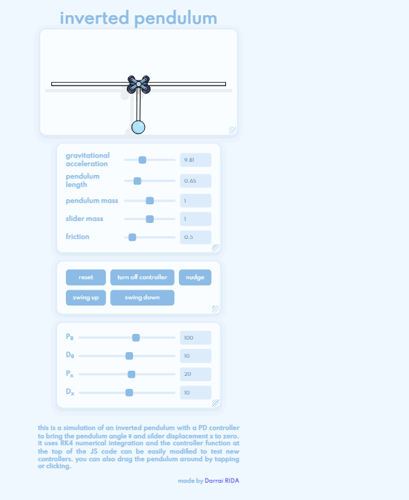
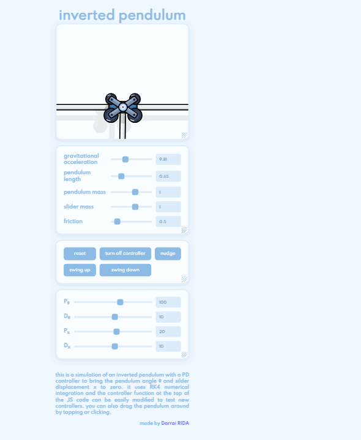
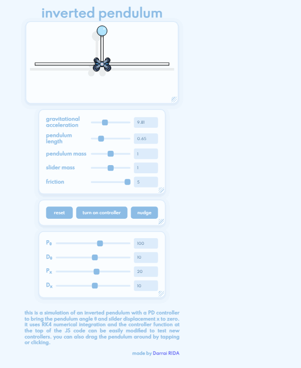
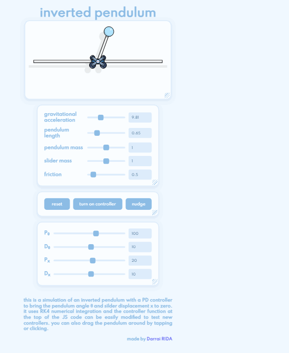

# Inverted Pendulum

A cart-pole simulation that runs in the browser: a pendulum on a cart riding a rail, swung from hanging to upright and kept there by a PD controller. Plain HTML, CSS, and JavaScript — no build step, no framework, no install.

**[Live demo](https://ridadarrai.github.io/The-inverted-pendulum/)** — or clone the repo and open `inverted-pendulum.html` in any browser.



## Features

- **RK4 physics** — the classic fourth-order Runge-Kutta method, four evaluations per 1.6 ms step, ten substeps per rendered frame
- **Energy-based swing-up** that hands the pendulum over to a **PD balancer** at the top, with automatic recatch if it gets knocked off
- **Live physics**: gravity, pendulum length, both masses, friction — all adjustable while it runs
- **Live PD tuning**: the four gains (P<sub>θ</sub>, D<sub>θ</sub>, P<sub>x</sub>, D<sub>x</sub>) are sliders
- **Pointer drag**: grab the pendulum bob and fling it — the drag enters the simulation as a spring force, so the physics never teleports
- **Draggable, resizable panels**: grab a panel anywhere and move it, resize from a corner or any edge (hold shift to move a single edge), fit-to-screen scaling
- **Rail wrap**: the cart reappears on the other side instead of bouncing off the ends — and the current controller is tuned not to need it

## Running it

Open `inverted-pendulum.html`. That is the whole setup.

## RL Visualizer

`rl-visualizer.html` is the project's second page: a dashboard for the reinforcement-learning side of the same CartPole. It plays back recorded episodes of a trained PPO policy, runs that policy live against a JavaScript port of the environment (up to 1000 agents), and — when the backend is up — streams training progress into the page as it happens. The pendulum page links to it from the footer, and back again.

### Serving it

Two ways, same files:

- **Static** — serve the repo root and open the page:
  ```
  python -m http.server 8000
  ```
  then <http://127.0.0.1:8000/rl-visualizer.html>. `data/*.json` are read as plain files — no backend, no live updates; replay starts playing as soon as the data loads. Opening the file directly (`file://`) does not work: browsers block `fetch` there, so the page shows a notice telling you to serve it over HTTP.
- **With the backend** — a FastAPI host that serves the visualizer at `/`, answers `/api/health`, and pushes a WebSocket stream of `rl:metrics` / `rl:policy` events whenever `data/training_metrics.json` or `data/policy.json` change on disk:
  ```
  cd backend
  uv sync
  uv run uvicorn server:app --port 8000
  ```
  then open <http://127.0.0.1:8000/>.

### Training and recording

```
cd backend
uv sync                  # first time: installs fastapi, uvicorn, sb3, torch
uv run python train.py   # PPO, eval every 10k steps → data/training_metrics.json + data/policy.json (+ checkpoints/)
uv run python record.py  # best checkpoint rollout → data/episodes.json (per-step obs, actions, probs, activations)
```

Leave `uvicorn` running while training — the badges and the network diagram follow each evaluation. Reserved for later: `set_agents` / `start` / `stop` control messages over the WebSocket; the server currently answers them with `not_implemented`.

### Controls

| control | what it does |
| --- | --- |
| `replay` / `live` | recorded episode playback vs the trained policy stepping the JS CartPole port |
| agents (`1` … `1000`) | population size in live mode — slider snaps to presets, number input accepts anything |
| speed (`0.25×` … `64×`, `MAX`) | step rate; `MAX` unrolls as fast as it can and the badge shows measured steps/s |
| `play` / `pause`, `reset` | transport |
| episode select + scrubber | pick a recorded episode and seek (replay only) |
| stochastic | sample actions from the policy's probabilities instead of taking the argmax |
| ghost trails | fading trails behind live agents |

### How it fits together

```
backend/train.py ─┐
backend/record.py ┤→ data/*.json ─→ js/ws.js (live push) or static fetch
                  │                    └→ js/app.js (controls, badges, data flow)
                  │                         └→ js/player.js (replay/live switching, transport)
                  │                              ├→ js/sources.js (recorded episodes / local simulation)
                  │                              │     └→ js/cartpole.js (env) + js/policy.js (policy forward)
                  │                              └→ js/stage.js · js/nn-viz.js · js/charts.js
```

`rl-contract.md` is the engineering contract for all of it: data schemas, module APIs (`window.RL.*`), design rules, and the ownership map.

## How it was built

**Layout first.** Before there was anything to simulate, I built the shell: panels on a page, each one draggable, resizable from corners and edges, with a fit-to-screen pass so nothing gets cut off on small windows, and content that scales with its panel. <sub>(`e0d9ce5` … `e402ea7`)</sub>
**Then the scene.** An SVG drawing — rail, cart, pole, shadows. The cart went through a few redesigns (gradient body, four wheels, an X-frame) before it looked like something worth balancing. <sub>(`c86215a` … `0f54591`)</sub>
**Then the physics.** The equations of motion as a state vector, integrated with RK4 and driven by a `requestAnimationFrame` loop — one commit, working simulation. <sub>(`1b80dbe`)</sub>
**Then the interaction.** Sliders and inputs bound to the state, buttons for reset / controller / nudge, pointer dragging on the bob through a spring force, and friction on both the cart and the pendulum. <sub>(`2af6b4a`, `8ff54f6`)</sub>
**Then the controller.** Swing-up started as a plain energy pump: push whenever the pendulum is short of the energy it needs to sit upright. Catching it was the fiddly part — gates on angle, angular velocity, cart speed, and cart position. I tuned it against a battery of start angles and friction levels until every case caught. The last pass was about rail travel: capping the deep-swing force, centering the cart, braking near the edges, and widening the track — 30 of 30 scenarios now catch with zero rail touches. Along the way I fixed a bug where the mass slider initialized through `exp()` and silently defaulted the mass to *e*. <sub>(`af70bc4` … `ee780cd`)</sub>

## How it works

No equations here — the references say it better.

- **The model** — one horizontal force has to control two things at once: where the cart goes and where the pole points. [Wikipedia's inverted pendulum article](https://en.wikipedia.org/wiki/Inverted_pendulum) covers the cart-and-pole setup and the derivations.
- **Integration** — [Runge-Kutta methods](https://en.wikipedia.org/wiki/Runge%E2%80%93Kutta_methods). The classic RK4 evaluates the derivatives four times per step to keep the trajectory accurate over long runs; at 1.6 ms per step it is far cheaper than the animation budget.
- **Balancing** — PD control, the proportional-derivative member of the [PID controller](https://en.wikipedia.org/wiki/PID_controller) family. The pole angle and the cart's offset from center are the proportional terms; their rates are the derivative terms. All four gains are exposed as sliders.
- **Swinging up** — energy shaping: keep pumping until the pendulum carries exactly the energy it needs to balance at the top, then catch it with the PD loop. Åström and Furuta's [Swinging up a pendulum by energy control](https://www.sciencedirect.com/science/article/abs/pii/S0005109899001405) (*Automatica*, 2000) is the classic treatment, and chapter 3 of Tedrake's free [Underactuated Robotics](https://underactuated.csail.mit.edu/) works through the cart-pole case step by step.

## The rail problem

Earlier builds pumped the cart so wide that it crossed the rail ends — the cart teleported across the track to keep its momentum, which looked as broken as it sounds.

| before — commit `7591a10` | after — current |
| :---: | :---: |
|  |  |

The wrap is still in the code as a safety net, but the tuned controller never calls on it: **6 start angles × 5 friction levels = 30 scenarios — every pendulum caught, 0 wraps, worst catch 5.0 s.**

## Controls

| control | what it does |
| --- | --- |
| `reset` | back to the start |
| `turn on controller` | enable the swing-up / balance controller |
| `nudge` | small kick, to test recovery |
| `swing up` | start the energy swing-up from hanging |
| `swing down` | controlled descent back to hanging |
| `g`, `l`, `M`, `m`, `f` | gravity, pendulum length, pendulum mass, cart mass, friction |
| `Pθ Dθ Pₓ Dx` | the four PD gains |
| drag the bob | spring-force drag on the pendulum |
| drag a panel | move it anywhere |
| corner / edge handles | resize a panel (shift = move a single edge) |

More of the interface in motion:

| panels | drag |
| :---: | :---: |
|  |  |

## Project files

- `inverted-pendulum.html` — page structure and the scene markup
- `inverted-pendulum.css` — layout, panels, and styling
- `inverted-pendulum.js` — physics, controller, and interaction
- `rl-visualizer.html` / `rl-visualizer.css` — the dashboard page and its styling
- `js/` — dashboard modules: panels, stage, charts, nn-viz, player, sources, cartpole, policy, ws, app
- `backend/` — FastAPI host (`server.py`), PPO training (`train.py`), recording (`record.py`), export/validation (`export.py`)
- `data/` — tracked JSON: policy, training metrics, recorded episodes
- `rl-contract.md` — the engineering contract the visualizer was built against

## License

[MIT](LICENSE)
